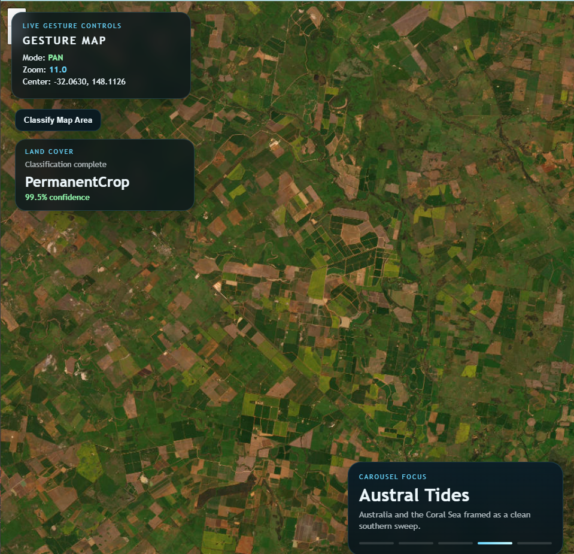
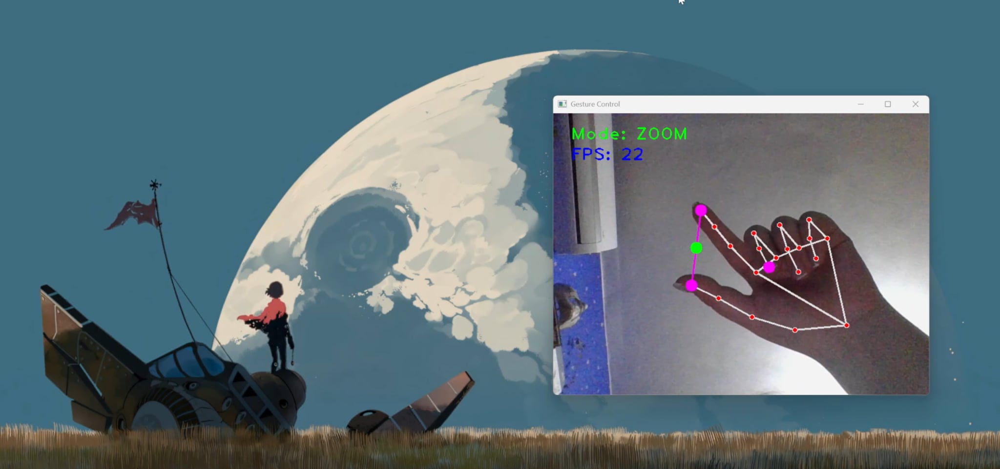
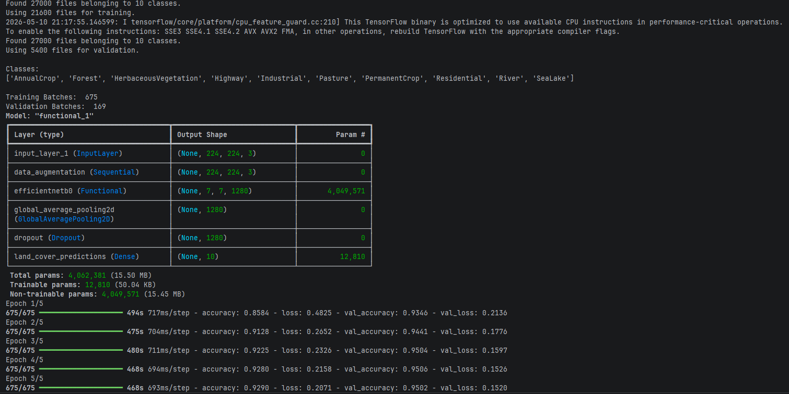

# Gesture Earth Observer

Gesture Earth Observer is a proof-of-concept Earth observation interface that combines real-time computer vision, gesture-based map control, and land-cover classification. The project uses a webcam as the input device, a browser-based satellite imagery map as the visual surface, and a trained deep learning model to classify the currently observed map area.

The satellite theme is intentional: the project explores how touchless interaction and ML-assisted visual interpretation could support exploratory workflows around geospatial and remote-sensing imagery.

## Preview



The browser map view with live gesture status panel, satellite carousel panel, and a visible classification result overlay.



The webcam window showing hand landmarks, active mode, and FPS.

## Features

- Real-time hand landmark detection using MediaPipe.
- Gesture-driven map navigation:
  - open palm swipe for satellite preset switching
  - thumb and index pinch for zoom
  - index and middle finger pinch for pan
  - two open palms for screenshot capture, classification, and result dismissal
- Browser-based Leaflet map using satellite imagery tiles.
- Center-crop screenshot capture from the current map viewport.
- Land-cover classification using a trained TensorFlow/Keras model.
- Lightweight local HTTP server for state synchronization between Python and the browser.

## Architecture

The project is split into three main layers:

1. **Computer vision and gesture control**

   `interactive_map.py` owns the webcam loop. It reads frames with OpenCV, detects hands with MediaPipe, extracts landmarks, and delegates gesture interpretation to modules in `gestures/`.

2. **Shared map state and local server**

   `map_state.py` stores the current map position, active gesture mode, satellite preset, transition state, and classification gesture events. `map_server.py` serves the browser UI, exposes `/state`, accepts screenshot uploads, and runs classification.

3. **Browser map interface**

   `web/map_view.html`, `web/js/map_view.js`, and `web/css/map_view.css` render the Leaflet map, poll the local server for gesture state, animate map transitions, capture the center crop, and display classification results.

This separation keeps the webcam processing loop independent from the browser UI while still allowing fast local feedback through a simple HTTP interface.

## Computer Vision Approach

Hand tracking is handled with MediaPipe Hands. The application uses selected hand landmarks rather than raw image classification for gesture control, which keeps the interaction responsive and interpretable.

Gesture logic is intentionally modular:

- `gestures/swipe.py` detects open palms and horizontal travel.
- `gestures/zoom.py` measures thumb-to-index distance.
- `gestures/pan.py` measures index-to-middle distance.
- `gestures/classification.py` detects two simultaneous open palms.
- `gestures/feedback.py` draws minimal camera feedback, keeping mode and FPS visible without obscuring the landmarks.

The gesture system uses frame thresholds, cooldowns, and simple state tracking to reduce accidental activations.

## Machine Learning Approach

Land-cover classification is implemented in `land_cover_classifier.py`. The classifier loads a trained Keras model from `models/land_cover_classifier.keras`, resizes input images to `224x224`, runs inference, and returns:

- predicted category
- confidence score
- per-class probabilities

The browser captures a `350x350` center crop from the satellite map viewport. The crop is saved to `screenshots/latest_map_crop.png`, then passed to the classifier.

The trained model is not committed directly to the repository. It is included as a GitHub release package and should be placed in the `models/` directory before running classification.

### Model Classes and Training

The model is trained to classify 10 land-cover categories:

```text
AnnualCrop, Forest, HerbaceousVegetation, Highway, Industrial,
Pasture, PermanentCrop, Residential, River, SeaLake
```

Training uses transfer learning with EfficientNetB0 pretrained on ImageNet. The base model is frozen, followed by global average pooling, dropout, and a softmax classification head. The dataset is loaded from `data/`, resized to `224x224`, split into training and validation subsets, and augmented with flips, rotation, and zoom.



Training output from the Keras model run, showing the model structure and training progress used for the included release package.

## Tools and Libraries

- Python
- OpenCV
- MediaPipe
- TensorFlow / Keras
- NumPy
- Pillow
- Leaflet
- html2canvas
- Standard-library `http.server` for the local browser bridge

## Project Structure

```text
gesture-earth-observer/
|-- gestures/                  # Gesture detection and camera feedback modules
|-- models/                    # Trained model and class names
|-- screenshots/               # Runtime map crops used for classification
|-- training/                  # Training and classifier test scripts
|-- web/                       # Browser map UI
|-- config.py                  # Gesture, camera, server, and satellite presets
|-- hand_detector.py           # MediaPipe hand detection wrapper
|-- interactive_map.py         # Main webcam and gesture loop
|-- land_cover_classifier.py   # Keras inference wrapper
|-- map_server.py              # Local HTTP server and classification endpoint
`-- map_state.py               # Shared state between Python and browser
```

## Setup

Create and activate a virtual environment, then install dependencies:

```powershell
python -m venv .venv
.\.venv\Scripts\activate
pip install -r requirements.txt
```

Download the trained model from the GitHub release package and place it here:

```text
models/land_cover_classifier.keras
```

Ensure `models/class_names.json` is present.

## Running the Project

Start the interactive map:

```powershell
python interactive_map.py
```

The application opens:

- a webcam window for hand tracking and landmark feedback
- a browser window at `http://127.0.0.1:8765` for the satellite map

Press `q` in the webcam window to stop the application.

## Gesture Reference

| Gesture | Action |
| --- | --- |
| Open palm swipe left or right | Switch satellite preset |
| Thumb and index pinch | Enter and control zoom |
| Index and middle fingers close together | Enter and control pan |
| Two open palms | Capture map crop and classify land cover |
| Two open palms after result | Clear classification overlay |

## Notes

This is a learning project and proof of concept, not a production geospatial analysis system. The focus is on demonstrating a complete pipeline: webcam-based gesture recognition, browser map control, screenshot capture, and ML inference over satellite-style imagery.

Future improvements could include stronger gesture disambiguation, model evaluation metrics in the UI, asynchronous inference handling, and integration with real remote-sensing datasets or tile metadata.
